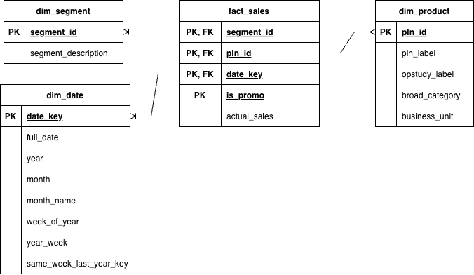

# Retail Sales Data Pipeline and Analytics Dashboard

This project is an end-to-end data engineering and analytics solution for processing, cleaning, and visualizing retail sales data. It uses a **Medallion Data Architecture** to progressively refine raw CSV data into a highly optimized **Star Schema**, which is then queried by a Streamlit dashboard.

---

## Architecture

### 1. Medallion Pipeline
*   **Raw (Bronze) Layer**: The initial uncleaned CSV data (`source_1150208_to_1171119_part.csv`).
*   **Quarantine Layer**: Invalid rows (e.g., missing critical keys, header pollution) are separated out during processing and stored in a quarantine file for later inspection, rather than failing the pipeline.
*   **Silver Layer**: Cleaned, standardized, and deduplicated records (`silver_sales.parquet`). This layer applies text normalization, parses dates, etc.
*   **Gold Layer**: The analytical layer structured as a **Star Schema**. 

### 2. Star Schema (Gold Layer)
The Gold layer is is structured as a Star Schema with the following entities and attributes:



#### Fact Table
*   **`fact_sales.parquet`**: Stores core transactional metrics.
    *   `date_key` (FK): Integer representation of the date (e.g., 20231015) for fast joins.
    *   `pln_id` (FK): Foreign key linking to the product dimension.
    *   `segment_id` (FK): Foreign key linking to the segment dimension.
    *   `is_promo`: Boolean flag indicating if the sale was tied to a promotion.
    *   `actual_sales`: The core metric representing the total sales volume/revenue.

#### Dimension Tables
*   **`dim_date.parquet`**: Contains rich date attributes for time-series analysis.
    *   `date_key` (PK): Primary key matching the fact table.
    *   `full_date`: Standard native Date object.
    *   `year`, `month`, `week_of_year`: Extracted calendar components.
    *   `same_week_last_year_key`: Helper key for rapid Year-over-Year (YoY) offset calculations.
*   **`dim_product.parquet`**: Contains product metadata and cleaned categorizations.
    *   `pln_id` (PK): The unique product identifier.
    *   `pln_label`: The human-readable product name or SKU description.
    *   `legacy_category_label`: The original, unmapped category from the raw data.
    *   `broad_category`: The dynamically mapped, clean top-level category (e.g., Health, Beauty, Grocery).
    *   `opstudy_label`: Operational study classification, polished for readability.
    *   `business_unit`: The business unit responsible for the item.
*   **`dim_segment.parquet`**: Contains inventory segmentation tiers.
    *   `segment_id` (PK): Segment identifier (e.g., 'A', 'B', 'C' inventory classifications).

---

## Tech Stack
*   **Polars**: Extremely fast, multi-threaded DataFrame library (replaces Pandas).
*   **DuckDB**: High-performance, in-process analytical SQL database. Used to query the Gold Parquet files directly from disk into the dashboard.
*   **Streamlit**: Pure Python web framework used to build the interactive dashboard.
*   **Plotly**: Interactive charting library used for the dashboard's visualizations.

---

## Key Engineering Decisions & Trade-offs

### Problems Solved
*   **Master Data Management Inconsistencies:** The raw data contained SKUs (PLNs) with multiple conflicting names and categories over time. This was solved using a "Golden Record" deduplication strategy that assigns the most recent, valid metadata to the SKU history.
*   **Dirty Data & Header Pollution:** Handled missing keys, `1YYMMDD` date formats, and embedded CSV headers without crashing the pipeline by using a dedicated Quarantine layer.
*   **Categorization Fragmentation:** Consolidated hundreds of fragmented and messy legacy categories into a clean, unified taxonomy using an in-memory exact-match and keyword-sweeping algorithm.
*   **Dashboard Out-of-Memory (OOM) Crashes:** Processing and visualizing ~20M rows natively in Pandas/Streamlit often causes memory crashes. By pairing DuckDB with Parquet, the app queries only the aggregated data it needs directly from disk.

### Advantages of Architecture
*   **Polars > Pandas:** Utilizing Polars for the ETL pipeline allows for multi-threaded execution and lazy evaluation, vastly speeding up the processing of the massive dataset compared to standard Pandas workflows.
*   **Parquet + Star Schema:** Columnar storage drastically reduces disk footprint (often 80%+ compression) and provides lightning-fast read speeds for analytical workloads where only specific columns are queried.
*   **DuckDB Integration:** Allows the Streamlit dashboard to act as a lightweight frontend while DuckDB acts as a high-performance query engine. The app never loads the 20M row dataset into memory.
*   **Medallion Modularity:** By saving intermediate states (Quarantine, Silver), the data is highly auditable. If a categorization rule changes, we only need to recalculate the Gold layer from the Silver layer, skipping the heavy CSV parsing.

### Drawbacks and Limitations
*   **Parquet Immutability:** Parquet files cannot be updated row-by-row (no simple `UPDATE` or `DELETE` statements). If a product changes categories, the dimension Parquet file must be completely overwritten. 
*   **Hardcoded Mapping Logic:** The category mapping rules (`EXACT_MATCHES`, `KEYWORD_MAPPINGS`) reside in Python code (`settings.py`). Business stakeholders cannot easily update categorization rules themselves without a developer modifying the codebase.
*   **Batch-Only Design:** The current pipeline is designed for bulk batch processing and is not optimized for real-time (streaming) data ingestion.
*   **Local Concurrency:** DuckDB is exceptional for fast analytical reads but is an in-process database. It is not designed to handle multiple concurrent *writers* to the same database file (though this is a non-issue for a read-only dashboard).

---

## Project Structure

```text
project2/
│
├── pyproject.toml                 # Package configuration for editable installation
├── README.md                      # Project documentation
│
├── data/                          # Local data storage (Ignored in source control)
│   ├── raw/                       # Initial CSV files
│   ├── quarantine/                # Dropped invalid records
│   ├── silver/                    # Cleaned base data
│   └── gold/                      # Star schema fact & dimension tables
│
└── src/                           # Source code directory
    ├── config/
    │   └── settings.py            # Central config: Paths, Category Mappings (Exact & Keyword rules), Polish rules.
    │
    ├── pipeline/
    │   ├── data_pipeline.py       # Core ETL orchestrator: loads raw data, writes Silver/Gold layers.
    │   └── transform.py           # Specific business logic: cleaning strings, fixing dates, resolving Golden Records.
    │
    ├── tools/
    │   └── eda_analysis.py        # Data Analytics of the solution
    │
    ├── dashboard/
    │   ├── app.py                 # Main Streamlit UI (Sales, Marketing, Inventory tabs).
    │   └── queries.py             # DuckDB SQL statements bridging the dashboard to the Parquet files.
    │
    └── run_pipeline.py            # Main entry point to execute the pipeline
```

---

## Guide to Run the Solution

### 1. Initial Setup
Ensure you have Python 3.10+ installed. It is recommended to use a virtual environment.
From the root of the project, install the dependencies and the project itself in editable mode:

```bash
# Create and activate a virtual environment (MacOS/Linux)
python -m venv venv
source venv/bin/activate

# Install dependencies and the local package
pip install -e .
```

### 2. Run the Data Pipeline
To parse the raw CSV, cleanse the data, generate the Medallion Star Schema:

```bash
python -m src.run_pipeline
```
*Note: Make sure your raw CSV file is located at `data/raw/source_1150208_to_1171119_part.csv` as defined in `settings.py`.*

### 3. Launch the Dashboard
To start the interactive Streamlit application and view the analytics:

```bash
streamlit run src/dashboard/app.py
```
This will spin up a local server and open the dashboard in your default web browser (usually at `http://localhost:8501`).

### 4. Run Unit Tests
The core data transformation, categorization, and deduplication logic is fully covered by a `pytest` suite. To run the automated tests:

```bash
python -m pytest -v
```

---

## Future Plans
1.  **Pipeline Orchestration**: Integrate Apache Airflow to schedule the pipeline runs daily/weekly automatically instead of manual execution.
2.  **Cloud Migration**: Move the `data/` directory to Amazon S3 or Google Cloud Storage, and deploy the Streamlit app.
3.  **dbt Integration**: Shift the final Star Schema (Gold Layer) transformations to use `dbt` (Data Build Tool) running on top of DuckDB or Snowflake for better data lineage and metric definitions.