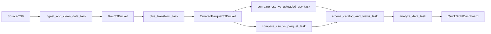

# Retail Legacy Data Processing: Extended Delivery Plan

## Simplicity-First Standards

- Prefer managed defaults and fewer components over custom frameworks.
- Use one AWS account + one `dev` environment only for this project phase.
- Keep Terraform readable: small number of files, clear variable names, minimal modules.
- Keep Airflow readable: one DAG, explicit Python tasks, no dynamic task factories.
- Keep SQL/analytics close to current logic, changing engine (DuckDB -> Athena) with minimal query rewrites.
- Document every step as a runbook so the workflow is reproducible for a first-time Terraform/Airflow/AWS user.

## Target Outcome

Migrate the current local Polars/DuckDB workflow to AWS-managed storage + compute + query, orchestrated by local Airflow (Docker), while preserving existing transformation quality and delivering BI insights.

## Current State (Gap Analysis)

- Local ETL exists and works in [data_pipeline.py](/Users/misha/Documents/vention/project2/src/pipeline/data_pipeline.py), [transform.py](/Users/misha/Documents/vention/project2/src/pipeline/transform.py), and [run_pipeline.py](/Users/misha/Documents/vention/project2/src/run_pipeline.py).
- Local dashboard SQL exists in [queries.py](/Users/misha/Documents/vention/project2/src/dashboard/queries.py) and app in [app.py](/Users/misha/Documents/vention/project2/src/dashboard/app.py).
- Missing entirely: Terraform infrastructure, Airflow DAGs, AWS integrations (S3/Glue/Athena/IAM), and BI cloud integration.

## Architecture Workflow

## Phase 1: MVP (by May 8) — must be runnable end-to-end

### 1) Terraform Foundation

- Add `infra/terraform` root with:
  - `providers.tf`, `versions.tf`, `variables.tf`, `outputs.tf`
  - `s3.tf` for raw and transformed buckets (versioning + encryption + lifecycle)
  - `iam.tf` for least-privilege roles/policies (Glue job role, Athena query role if needed)
  - `glue.tf` for Python Shell job and script location
  - `athena.tf` for Athena workgroup + query-results location + database bootstrap
- Add `infra/terraform/environments/dev.tfvars` for local/dev deployment.
- Keep structure flat (no custom reusable modules initially) to reduce learning overhead.
- Add `Makefile` shortcuts for safe commands: `terraform fmt`, `terraform validate`, `terraform plan`, `terraform apply`.

### 2) AWS-Aware Pipeline Refactor (reuse existing logic)

- Split current monolithic runner in [data_pipeline.py](/Users/misha/Documents/vention/project2/src/pipeline/data_pipeline.py) into stageable entrypoints:
  - ingest/clean stage
  - transform-to-parquet stage
  - validation stage
- Keep transformation semantics in [transform.py](/Users/misha/Documents/vention/project2/src/pipeline/transform.py), but parameterize IO (local path vs `s3://` target).
- Extend config in [settings.py](/Users/misha/Documents/vention/project2/src/config/settings.py) with environment-driven AWS names (bucket, prefixes, Glue job name, Athena DB/workgroup).

### 3) Airflow DAG (local Docker)

- Add local Airflow stack (`docker-compose` + DAG folder + requirements for AWS providers).
- Implement DAG with retries, timeout, and failure callbacks:
  - `ingest_and_clean_data_task`
  - `upload_raw_csv_task`
  - `transform_data_task` (invoke Glue Python Shell)
  - `compare_csv_to_uploaded_csv_task` (row-count equality)
  - `compare_csv_to_parquet_task` (row-count equality)
- Add cleanup task for temp artifacts and partial local outputs.
- Use only core operators/hooks first (`PythonOperator` + `boto3` wrappers), avoiding advanced Airflow abstractions.
- Add a local smoke-test path: run each task function directly before wiring full DAG dependencies.

### 4) MVP Acceptance Gates

- Terraform apply creates required AWS resources in a clean account.
- One DAG run succeeds from source CSV to parquet in transformed S3 bucket.
- Two integrity checks pass (CSV vs uploaded CSV, CSV vs parquet counts).
- Runbook documents setup, DAG trigger, and rollback steps.

## Phase 2: Full Version (May 9–15)

### 5) Athena Modeling and Query Automation

- Create Glue Catalog tables over transformed parquet and required Athena views.
- Port core analytic SQL intent from [queries.py](/Users/misha/Documents/vention/project2/src/dashboard/queries.py) to Athena-compatible SQL artifacts.
- Add Airflow task for DDL deployment and SQL execution output materialization.

### 6) BI Dashboard Implementation

- Build an actual BI dashboard (QuickSight preferred) over Athena datasets:
  - sales trends
  - promo effectiveness
  - segment-wise performance
- Include refresh strategy and data-source credentials approach.
- Add dashboard build/config steps to project docs and reproducible setup notes.
- Start with one dashboard + 3-5 core visuals before adding advanced drill-downs.

### 7) Reliability, Cost, and Ops

- Standardize retry policy and failure handling across DAG tasks.
- Ensure cleanup/lifecycle policies minimize storage/query cost.
- Add service cost section (S3, Glue Python Shell, Athena scans, Airflow local infra, QuickSight licensing/session model) with assumptions and monthly estimate bands.

## File-Level Implementation Roadmap

- Extend: [settings.py](/Users/misha/Documents/vention/project2/src/config/settings.py), [data_pipeline.py](/Users/misha/Documents/vention/project2/src/pipeline/data_pipeline.py), [run_pipeline.py](/Users/misha/Documents/vention/project2/src/run_pipeline.py), [queries.py](/Users/misha/Documents/vention/project2/src/dashboard/queries.py), [README.md](/Users/misha/Documents/vention/project2/README.md)
- Add: `infra/terraform/*`, `airflow/dags/*.py`, `airflow/docker-compose.yml`, `src/aws/*` (S3/Glue/Athena adapters), BI setup docs (likely `docs/bi_dashboard.md`)

## Execution Sequence

- Week 1 (Apr 20–26): AWS fundamentals setup + flat Terraform baseline + first successful `terraform apply` in `dev`.
- Week 2 (Apr 27–May 3): Refactor ETL entrypoints + Glue execution + Airflow DAG wiring with local smoke tests.
- Week 3 (May 4–8): MVP end-to-end run + two integrity checks + retries/cleanup + runbook walkthrough.
- Extension (May 9–15): Athena analytics layer + single production-like QuickSight dashboard + cost section.

## Risks to Track

- Glue Python Shell package compatibility for Polars.
- Athena SQL differences vs DuckDB metrics logic.
- QuickSight access/setup lead time and dataset refresh permissions.
- Row-count parity edge cases due to cleaning rules and dedup behavior.
- Potential Out-Of-Memory (OOM) errors in Airflow worker during ingestion (`ingest.py`): plan to transition from `io.BytesIO` to `tempfile.NamedTemporaryFile` if the 20M row payload exceeds local Docker RAM limits.
